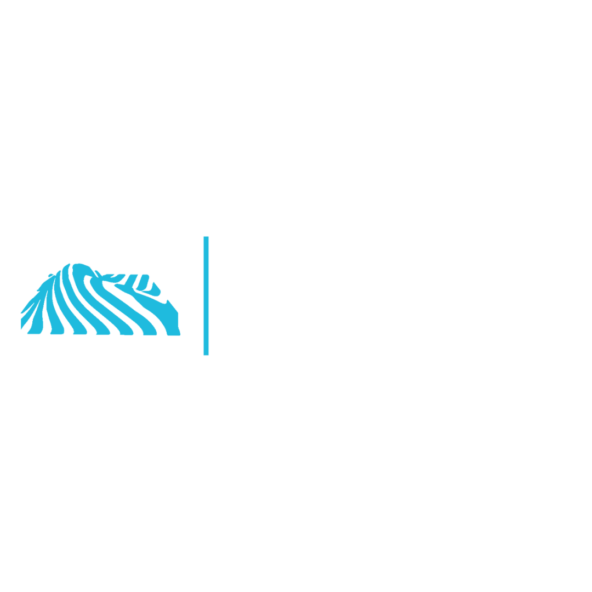

<div align="center">

[](https://git.io/typing-svg)

### Full Stack Developer | React · Next.js · Java Spring Boot Reactivo

<br>

[](https://www.linkedin.com/in/francisco-herr%C3%A1n-cerezo/)
[](https://alhertech.com)
[](mailto:francisco.herran@alhertech.com)

<br>



</div>

---

## About Me
```typescript
const francisco = {
    location: "Madrid, Spain",
    role: "Full Stack Developer & Co-Founder @ Alher Tech",
    education: "Software Engineering @ Universidad Politécnica de Madrid",

    currentlyWorking: [
        "Boathous - Boat rental marketplace",
        "Alher Tech - Custom software development agency"
    ],

    skills: {
        frontend: ["React", "Next.js", "TypeScript", "Tailwind", "Astro"],
        backend: ["Java Spring Boot Reactivo", "Node.js", "Python"],
        databases: ["PostgreSQL", "MongoDB", "Redis"],
        cloud: ["AWS", "Vercel", "Cloudflare", "Docker"],
        realtime: ["WebSockets", "Chat systems", "Live notifications"],
        integrations: ["Stripe", "OpenAI API", "Google Maps", "Twilio", "Resend"]
    },

    funFact: "I build complete applications from zero to production in weeks"
};
```

---

## Career

| Company | Role | Description |
|---------|------|-------------|
| **Alher Tech** | Co-Founder & Lead Developer | Custom software development agency. +9 projects in production. |
| **Boathous Charter S.L.** | Full Stack Software Engineer | Boat rental marketplace handling thousands of concurrent requests. |

---

## Languages

<div align="center">


</div>

## Stack

<div align="center">


</div>

---

## GitHub Stats

<div align="center">


</div>

<div align="center">

[](https://git.io/streak-stats)

</div>

<div align="center">


</div>

---

## Projects in Production

<div align="center">

| Project | Description | Stack |
|---------|-------------|-------|
| [**boathous.com**](https://boathous.com) | Boat rental & sales marketplace | React, Tailwind, Java Spring Boot Reactivo, PostgreSQL, Stripe |
| [**alquilia.io**](https://alquilia.io) | AI-powered rental management | Next.js, TypeScript, Spring Boot, OpenAI API |
| [**nurdoc.es**](https://nurdoc.es) | Home healthcare platform | Next.js, React, Spring Boot, Google Maps API |
| [**almia.education**](https://almia.education) | AI educational platform | Next.js, TypeScript, Java Spring Boot Reactivo, OpenAI API |
| [**reservpark.com**](https://reservpark.com) | Smart parking app | React Native, Next.js, Spring Boot, AWS |

</div>

---

## Let's Connect

<div align="center">

Open to interesting projects and collaborations

Reach me at **francisco.herran@alhertech.com**

Check out my work at [**alhertech.com**](https://alhertech.com)

</div>

---

<div align="center">


</div>
